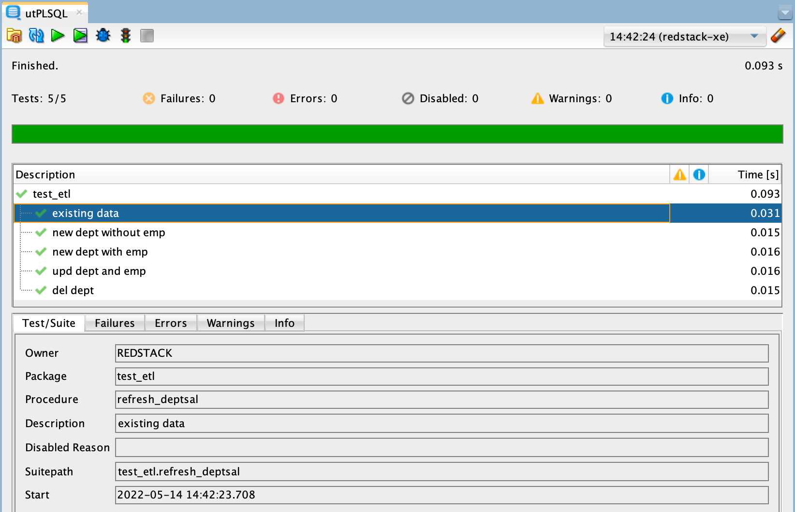
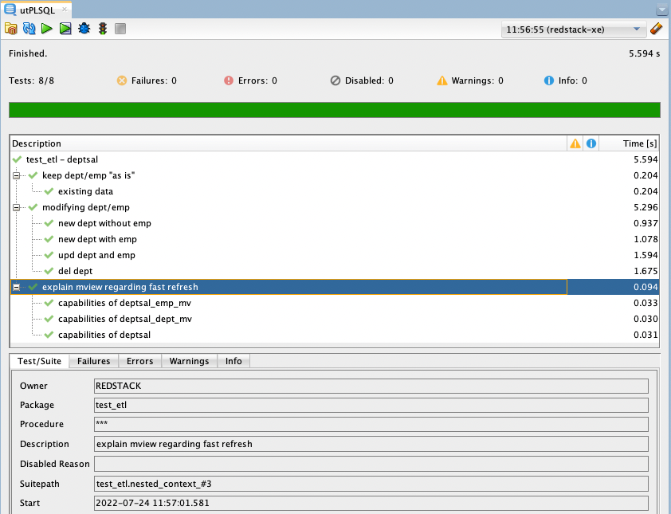

# utplsql-red-stack-demo

This repository contains the full examples used for the article named "Testen mit utPLSQL - Leicht gemacht mit SQL Developer". The article is planned to be published in issue 4/2022 of the [Red Stack Magazin](https://www.doag.org/de/mitmachen/red-stack-business-news-archiv/).

# User Story

The article is based on the following fictitious user story based on a schema using the famous tables [`dept`](src/main/table/dept.sql) and [`emp`](src/main/table/emp.sql):

> As a HR manager, I need a table with the key figures salary total, number of employees and average salary per department to assess fairness.

# Common Setup

The scripts [`create_user.sql`](create_user.sql) is used to create an Oracle Database user named `redstack` within an Oracle Database 19c (or newer) with the necessary privilges. 

The script [`drop_user.sql`](drop_user.sql) drops the user `redstack` with all its content.

Both scripts must be executed as user `SYS`. 

All other scripts are meant to be executed as user `redstack`.

# Solution Variants

The following solution variants are implemented:

Id | Name  | Description
-- | ----- | -----------
A  | DIY   | A do-it-yourself solution using a table, PL/SQL package and database triggers. It will be created step by step. Each step is represented as a branch in this repository. The tests created during the implementation of this solution can be reused for solution variant B.
B  | View  | This solution uses a simple relational view to solve the problem. It's the simpler and better solution.
C  | MView | This solution uses a set of materialized views and materialized view logs. It shows how to work around the limitations of materialized views which prohibit the use of the query used in solution variant B as base for the materialized view.
D  | Mixed | This solution uses one materialized view on an inner join of `dept` and `emp` (outer joining `emp` leads to an ORA-12054). The view is based on table `dept` and the materialized view. The view handles departments without employees. This solution variant is simpler and faster than the variant C.

Solution variant A and B are part of the article. Solution variant C and D are not covered in the article. They have been crafted for completeness.

Branch comparisons are used to visualize the changes between solution variants and steps within a solution variant.

Use the script [`install.sql`](install.sql) to install a variant as user `redstack`.

## A - DIY - 1) Test Error

See branch [a-diy-test-1-error](https://github.com/PhilippSalvisberg/utplsql-red-stack-demo/tree/a-diy-test-1-error).

## A - DIY - 2) Test Failure

See branch [a-diy-test-2-failure](https://github.com/PhilippSalvisberg/utplsql-red-stack-demo/tree/a-diy-test-2-failure).

[Compare to previous branch](https://github.com/PhilippSalvisberg/utplsql-red-stack-demo/compare/a-diy-test-1-error...a-diy-test-2-failure).

## A - DIY - 3) Test Success 

See branch [a-diy-test-3-success](https://github.com/PhilippSalvisberg/utplsql-red-stack-demo/tree/a-diy-test-3-success).

[Compare to previous branch](https://github.com/PhilippSalvisberg/utplsql-red-stack-demo/compare/a-diy-test-2-failure...a-diy-test-3-success).

## A - DIY - 4) Test Insert/Update/Delete

See branch [a-diy-test-4-ins-upd-del](https://github.com/PhilippSalvisberg/utplsql-red-stack-demo/tree/a-diy-test-4-ins-upd-del).

[Compare to previous branch](https://github.com/PhilippSalvisberg/utplsql-red-stack-demo/compare/a-diy-test-3-success...a-diy-test-4-ins-upd-del).

## A - DIY - 5) Test Trigger

See branch [a-diy-test-5-trigger](https://github.com/PhilippSalvisberg/utplsql-red-stack-demo/tree/a-diy-test-5-trigger).

[Compare to previous branch](https://github.com/PhilippSalvisberg/utplsql-red-stack-demo/compare/a-diy-test-4-ins-upd-del...a-diy-test-5-trigger).

## B - View - Test

See branch [b-view-test](https://github.com/PhilippSalvisberg/utplsql-red-stack-demo/tree/b-view-test).

[Compare to previous branch](https://github.com/PhilippSalvisberg/utplsql-red-stack-demo/compare/a-diy-test-5-trigger...b-view-test).

## C - MView - Test

See branch [c-mview-test](https://github.com/PhilippSalvisberg/utplsql-red-stack-demo/tree/c-mview-test).

[Compare to previous branch](https://github.com/PhilippSalvisberg/utplsql-red-stack-demo/compare/b-view-test...c-mview-test).

## D - Mixed - Test

See branch [d-mixed-test](https://github.com/PhilippSalvisberg/utplsql-red-stack-demo/tree/d-mixed-test).

[Compare to previous branch](https://github.com/PhilippSalvisberg/utplsql-red-stack-demo/compare/c-mview-test...d-mixed-test).
